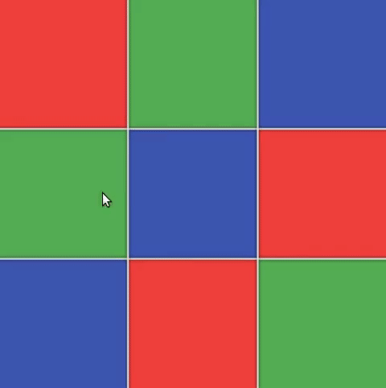

[](https://www.npmjs.com/package/@resize/grid-me)
![Built With Stencil](https://img.shields.io/badge/-Built%20With%20Stencil-16161d.svg?logo=data%3Aimage%2Fsvg%2Bxml%3Bbase64%2CPD94bWwgdmVyc2lvbj0iMS4wIiBlbmNvZGluZz0idXRmLTgiPz4KPCEtLSBHZW5lcmF0b3I6IEFkb2JlIElsbHVzdHJhdG9yIDE5LjIuMSwgU1ZHIEV4cG9ydCBQbHVnLUluIC4gU1ZHIFZlcnNpb246IDYuMDAgQnVpbGQgMCkgIC0tPgo8c3ZnIHZlcnNpb249IjEuMSIgaWQ9IkxheWVyXzEiIHhtbG5zPSJodHRwOi8vd3d3LnczLm9yZy8yMDAwL3N2ZyIgeG1sbnM6eGxpbms9Imh0dHA6Ly93d3cudzMub3JnLzE5OTkveGxpbmsiIHg9IjBweCIgeT0iMHB4IgoJIHZpZXdCb3g9IjAgMCA1MTIgNTEyIiBzdHlsZT0iZW5hYmxlLWJhY2tncm91bmQ6bmV3IDAgMCA1MTIgNTEyOyIgeG1sOnNwYWNlPSJwcmVzZXJ2ZSI%2BCjxzdHlsZSB0eXBlPSJ0ZXh0L2NzcyI%2BCgkuc3Qwe2ZpbGw6I0ZGRkZGRjt9Cjwvc3R5bGU%2BCjxwYXRoIGNsYXNzPSJzdDAiIGQ9Ik00MjQuNywzNzMuOWMwLDM3LjYtNTUuMSw2OC42LTkyLjcsNjguNkgxODAuNGMtMzcuOSwwLTkyLjctMzAuNy05Mi43LTY4LjZ2LTMuNmgzMzYuOVYzNzMuOXoiLz4KPHBhdGggY2xhc3M9InN0MCIgZD0iTTQyNC43LDI5Mi4xSDE4MC40Yy0zNy42LDAtOTIuNy0zMS05Mi43LTY4LjZ2LTMuNkgzMzJjMzcuNiwwLDkyLjcsMzEsOTIuNyw2OC42VjI5Mi4xeiIvPgo8cGF0aCBjbGFzcz0ic3QwIiBkPSJNNDI0LjcsMTQxLjdIODcuN3YtMy42YzAtMzcuNiw1NC44LTY4LjYsOTIuNy02OC42SDMzMmMzNy45LDAsOTIuNywzMC43LDkyLjcsNjguNlYxNDEuN3oiLz4KPC9zdmc%2BCg%3D%3D&colorA=16161d)

# GridMe - Universal Resizable Grid

`GridMe` is a universal grid layout built with [Stencil](http://stenciljs.com). It can be embedded in projects using any framework or even plain HTML. Under the hood `GridMe` leverages the [`SplitMe`](https://github.com/alesgenova/split-me) component.



## Installing

### Option 1 (HTML)

Add the `GridMe` script tag to your `index.html`:

```
<script src="https://unpkg.com/@resize/grid-me/dist/grid-me.js"></script>
```

### Option 2 (React / Angular / Vue)

Add `GridMe` to your project:

```
npm install --save @resize/grid-me
```

Import `GridMe` in your `index.js`:

```js
import { defineCustomElements as defineGridMe } from '@resize/grid-me/dist/loader';

defineGridMe(window);
```

## Basic Usage

Use the `grid-me` tag anywhere you like. Set the number of rows and columns in the layout through the `m` and `n` attributes respectively. Set where the inner elements should be placed through the `slot` attribute:

```html
<grid-me m="2" n="2">
  <div slot="0 0" class="fill red"></div>
  <div slot="0 1" class="fill green"></div>
  <div slot="1 0" class="fill green"></div>
  <div slot="1 1" class="fill red"></div>
</grid-me>

<style>
  .fill {
    height: 100%;
    width: 100%;
  }
</style>
```
